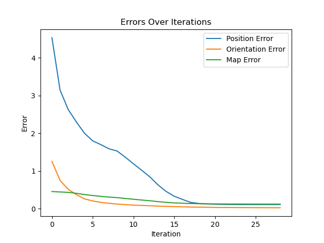

# Planar Monocular Slam

Project of the Probabilistic Robotics Course at Sapienza University of Rome. The goal is to develop a planar monocular slam pipeline, given a dataset made of noisy odometry and measurement made by a monocular camera. The goal is to estimate the position of the perceived landmarks and correct the drift in the odometry, based on these observations.

## Problem

Differential Drive equipped with a monocular camera.

### Input

- Integrated dead reckoning (wheeled odometry)
- Stream of point projections with "id"
- Camera parameters
  - Extrinsics (pose of camera on robot)
  - Intrinsics (K)

### Output

- Trajectory (estimate vs gt)
- 3D points (estimate vs gt)
- Error values (rotation and translation)

The solution can be divided in two macro-steps: triangulation and bundle adjustment.

## Triangulation [1]

Given:
*   A set of $M \ge 2$ 2D image projections $\mathbf{x}_j = [u_j, v_j]^T$ for a single landmark, observed from $M$ different camera views.
*   The camera intrinsic matrix $K$ (3x3).
*   The camera extrinsics relative to the robot: $T_{RC}$ (a 4x4 transformation from camera frame to robot frame).
*   The robot's odometry pose for each view $j$: $T_{WR}^{(j)}$ (a 4x4 transformation from robot frame to world frame).

We want to find the 3D position of the landmark in homogeneous world coordinates, $\mathbf{X}_w = [X, Y, Z, 1]^T$.

#### 1. Projection Equation

For each view $j$, the projection of the 3D world point $\mathbf{X}_w$ onto the image plane $\mathbf{x}_{img, j} = [u_j, v_j, 1]^T$ is described by:

$s_j \mathbf{x}_{img, j} = P^{(j)} \mathbf{X}_w$

where:
*   $s_j$ is a non-zero scale factor for view $j$.
*   $P^{(j)}$ is the $3 \times 4$ camera projection matrix for view $j$.

#### 3. Direct Linear Transform (DLT)

The projection equation implies that $\mathbf{x}_{img, j}$ and $P^{(j)} \mathbf{X}_w$ are collinear. Thus, their cross product is zero [1, Slides 15-21]:

$\mathbf{x}_{img, j} \times (P^{(j)} \mathbf{X}_w) = \mathbf{0}$

Substituting $\mathbf{x}_{img, j} = [u_j, v_j, 1]^T$ and $P^{(j)} \mathbf{X}_w = \begin{pmatrix} \mathbf{p}_{j1}^T \mathbf{X}_w \\ \mathbf{p}_{j2}^T \mathbf{X}_w \\ \mathbf{p}_{j3}^T \mathbf{X}_w \end{pmatrix}$, the cross product yields three equations, two of which are linearly independent:

1.  $(v_j \mathbf{p}_{j3}^T - \mathbf{p}_{j2}^T) \mathbf{X}_w = 0$
2.  $(\mathbf{p}_{j1}^T - u_j \mathbf{p}_{j3}^T) \mathbf{X}_w = 0$

#### 4. Solving the System

For $M$ observations, we stack these $2M$ equations into a single homogeneous linear system:

$A \mathbf{X}_w = \mathbf{0}$

where $A$ is a $(2M \times 4)$ matrix. Since measurements are noisy, this system is solved in a least-squares sense to find $\mathbf{X}_w$ that minimizes $||A \mathbf{X}_w||^2$.

### Robust Landmark Triangulation

Actually, triangulation over all measurements turned out to give bad results. Instead, what gave better results was using a RANSAC-like approach.
For each consecutive frame pair $(i, i+1)$:
1. Compute camera poses: ${}^CT_{W}^{(i)}$ and ${}^CT_{W}^{(i+1)}$
2. Identify landmarks visible in both frames
3. Extract corresponding 2D measurements: $\mathbf{x}_i = [u_i, v_i]^T$ and $\mathbf{x}_{i+1} = [u_{i+1}, v_{i+1}]^T$

Then, For each landmark visible in both consecutive frames, the method applies the Direct Linear Transform (DLT) algorithm using only two views.

This results in a $(4 \times 4)$ linear system:
$$
A \mathbf{X}_w = \mathbf{0}
$$

Each triangulated point undergoes strict outlier detection using the `isOutlier` method:

1. **Cheirality Check**: Verify the point is in front of both cameras
   - Transform point to camera coordinates: $\mathbf{p}_{cam} = T_{CW} \mathbf{X}_w$
   - Check: $Z_{cam} > 0$ and $Z_{cam} \leq z_{far}$

2. **Reprojection Error Check**:
   - Reproject the 3D point back to 2D: $\mathbf{x}_{reproj} = K [R|t] \mathbf{X}_w$
   - Compute error: $||\mathbf{x}_{reproj} - \mathbf{x}_{measured}||_2$
   - Reject if error $> 10.0$ pixels

For each landmark, the algorithm collects multiple triangulation estimates from different consecutive frame pairs where the landmark was visible. The final 3D position is computed as:

$$\mathbf{X}_{final} = \frac{1}{N} \sum_{k=1}^{N} \mathbf{X}_k$$

where $N$ is the number of valid triangulation estimates that passed the outlier filtering.

## Bundle Adjustment

Once the initial guess about the map is given, the optimization process can start.

### State

### Prediction

### Jacobians

### Robust Kernel

## Results

### Triangulation

Errors:
- Root Mean Square Error (RMSE): 1.3055
- Mean Absolute Error (MAE): 0.5197
- MAE per coordinate: X=0.7529, Y=0.6608, Z=0.1455
- Mean Euclidean Distance: 1.1177
- Median Euclidean Distance: 0.9129

Component-wise errors:
  - X-axis: Mean=0.2444, Std=0.9229, Min=-3.1103, Max=2.3314
  - Y-axis: Mean=-0.1817, Std=0.8475, Min=-2.6715, Max=3.4090
  - Z-axis: Mean=0.1386, Std=0.1496, Min=-0.1913, Max=0.7830

Valid landmarks: 783/1000 (78.3%)

### Bundle Adjustment

After 41 iterations:

- Map RMSE $  = 0.1235 $
- Linear Trajectory Error $ = 0.1140 $
- Angular Trajectory Error $ = 0.0282 $

Comments:

- The ground truth landmarks that are not superposed by an estimate are the ones that are never seen in any measurement.
- Linear error is not perfect, could probably enhanced by better outlier detection searching for good parameters or an even better initial guess

### References

[1] Kris Kitani, "Triangulation," 16-385 Computer Vision, Carnegie Mellon University. [Online]. Available: [https://www.cs.cmu.edu/~16385/s17/Slides/11.4_Triangulation.pdf](https://www.cs.cmu.edu/~16385/s17/Slides/11.4_Triangulation.pdf)
